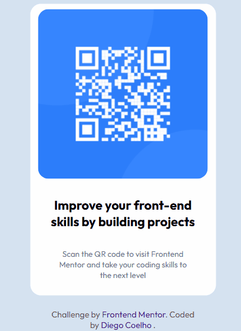

# Primeiro Desafio FrontEnd Mentor Qr-code-component 
Realizado durante estudos HTML5 e CSS3 intermediário curso DevQuest.🚀

## Tecnologias utilizadas
- HTML
- CSS

## Objetivos
- Testar minhas habilidades adquiridas nas aulas do curso.
- Uso de responsividade para telas menores.
- Adiçao de link de meu perfil Github .
## Prévia da aplicação

[]

